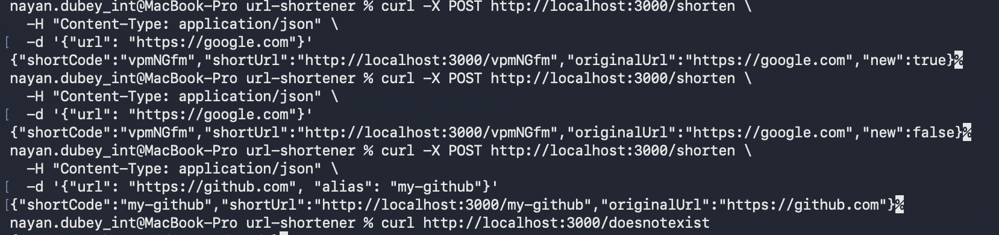

# URL Shortener

A URL shortening service with custom aliases, idempotent duplicate handling, and link click tracking.

## Stack

- **Runtime**: Node.js
- **Framework**: Express.js
- **Database**: MongoDB + Mongoose
- **Tests**: Jest + Supertest + mongodb-memory-server (no external DB needed to run tests)

## Prerequisites

- Node.js >= 18
- MongoDB running locally (or provide a `MONGO_URI` in `.env`)

## Install

```bash
git clone <repo-url>
cd url-shortener
npm install
```

## Configure

```bash
cp .env.example .env
# Edit .env if needed — defaults work with a local MongoDB on port 27017
```

## Run

```bash
# Development (auto-restart on changes)
npm run dev

# Production
npm start
```

Server starts on `http://localhost:3000`.

## Test

```bash
npm test
```

Tests use an in-memory MongoDB — no external database required.

## API

### POST /shorten

Shorten a URL. Optionally provide a custom alias.

**Request:**
```json
{
  "url": "https://example.com/some/very/long/path",
  "alias": "my-link"
}
```

**Response 201** (new entry):
```json
{
  "shortCode": "my-link",
  "shortUrl": "http://localhost:3000/my-link",
  "originalUrl": "https://example.com/some/very/long/path",
  "new": true
}
```

**Response 200** (duplicate URL, returns existing code):
```json
{
  "shortCode": "1BxYkP",
  "shortUrl": "http://localhost:3000/1BxYkP",
  "originalUrl": "https://example.com/some/very/long/path",
  "new": false
}
```

**Error responses:**
- `422` — invalid or unsafe URL
- `409` — custom alias already taken

### GET /:code

Redirects to the original URL (HTTP 301). Returns `404` if the code does not exist.

**Example:**
```bash
curl -v http://localhost:3000/my-link
# < HTTP/1.1 301 Moved Permanently
# < Location: https://example.com/some/very/long/path
```

## Demo



## Design decisions

See [WRITEUP.md](./WRITEUP.md) for the full write-up on design decisions and trade-offs.
